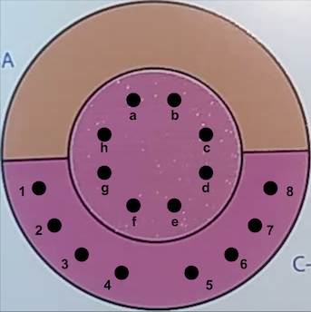

# Project RE-MASK
Project RE-MASK is an effort to create an improvised device for the sanitization and disinfection of personal protective equipment in non-academic health science centers.


# Running the script to process a video file
#### Step 1: 
Install Python3 if you don't already have it installed, and record the video. To aid in the accuracy of the program, keep the camera as steady as possible while filming.
#### Step 2:
Create a folder in a convenient location on your system and place the .mp4 file to be processed inside of it.
#### Step 3: 
Using your Command Line or Terminal, move to the folder that was created in Step 2 and execute the following command: ```python3 remask.py```
#### Step 4: 
The program will walk you through a few prompts, asking for the name of the .mp4 file to be processed and whether you would like all of the data or a subset of filtered data.
#### Step 5: 
At this point, the program will begin extracting frames from the video file and cropping them down to size. Below is an example of a cropped frame that we then extract RGB data values from. For color value accuracy, eight points are sampled from within the baseline color region (labeled **1** to **8**), and eight are sampled from the center testing region (labeled **a** to **h**).



#### Step 6: 
After the frames have been extracted, the RGB values will be read from the images, and the frames will be deleted. The final processed data will be exported to a .csv file within the same folder entitled _data.csv_.
